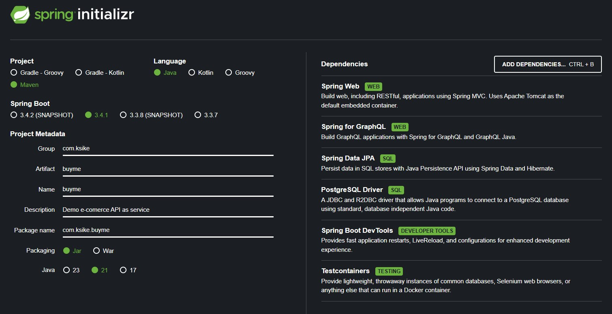

## Buyme Services based on SpringBoot

## Getting Started
- UPDATE `pom.xml`
- UPDATE `src\main\resources\application.properties`
- mvn clean install
- mvn spring-boot:run 
- http://localhost:8081/graphiql?path=/graphql




## Tools 
- [Spring Initializr](https://start.spring.io/)
- [OpenJdk Portal](https://jdk.java.net/)
- [Java Dev Portal](https://dev.java/)
- [Spring Tools](https://spring.io/tools)

### References 
- [Curso Spring Boot #3](https://www.youtube.com/watch?v=YbvZe1wDQqQ&list=PLyvsggKtwbLVOPuOGn9J1Ie9RD7r7LcWD&index=3)
- [Master Service Discovery in Microservices | Eureka and Java Spring Boot](https://www.youtube.com/watch?v=ecuEkmFs5Vk)
- [Spring Boot, Spring Security, JWT Course – Shopping Cart Backend Java Project](https://www.youtube.com/watch?v=oGhc5Z-WJSw)

### Documentation
For further reference, please consider the following sections:

* [Official Apache Maven documentation](https://maven.apache.org/guides/index.html)
* [Spring Boot Maven Plugin Reference Guide](https://docs.spring.io/spring-boot/3.3.7/maven-plugin)
* [Create an OCI image](https://docs.spring.io/spring-boot/3.3.7/maven-plugin/build-image.html)
* [Spring Web](https://docs.spring.io/spring-boot/3.3.7/reference/web/servlet.html)
* [Spring for GraphQL](https://docs.spring.io/spring-boot/3.3.7/reference/web/spring-graphql.html)

### Guides
The following guides illustrate how to use some features concretely:

* [Building a RESTful Web Service](https://spring.io/guides/gs/rest-service/)
* [Serving Web Content with Spring MVC](https://spring.io/guides/gs/serving-web-content/)
* [Building REST services with Spring](https://spring.io/guides/tutorials/rest/)
* [Building a GraphQL service](https://spring.io/guides/gs/graphql-server/)

### Maven Parent overrides

Due to Maven's design, elements are inherited from the parent POM to the project POM.
While most of the inheritance is fine, it also inherits unwanted elements like `<license>` and `<developers>` from the parent.
To prevent this, the project POM contains empty overrides for these elements.
If you manually switch to a different parent and actually want the inheritance, you need to remove those overrides.

### Project
```
src
 └── main
     ├── java
     │   └── com
     │       └── ksike
     │           └── buyme
     │               ├── articles
     │               │   ├── application
     │               │   │   ├── controller
     │               │   │   │   └── ArticleController.java
     │               │   │   ├── dto
     │               │   │   │   └── ArticleDto.java
     │               │   │   └── mapper
     │               │   │       └── ArticleMapper.java
     │               │   ├── domain
     │               │   │   ├── model
     │               │   │   │   └── Article.java
     │               │   │   ├── repository
     │               │   │   │   └── ArticleRepository.java
     │               │   │   └── service
     │               │   │       └── ArticleService.java
     │               │   └── infrastructure
     │               │       ├── adapter
     │               │       │   └── JpaArticleRepository.java
     │               │       └── graphql
     │               │           └── ArticleGraphQL.java
     │               └── BuymeApplication.java
```
